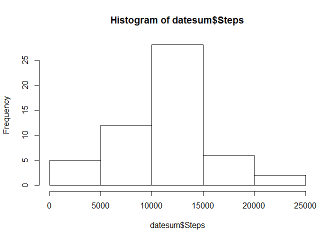
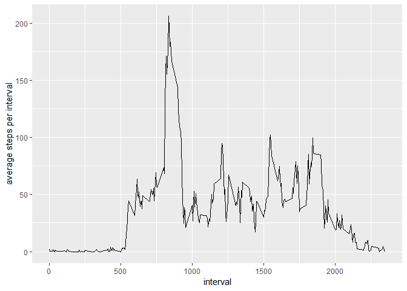
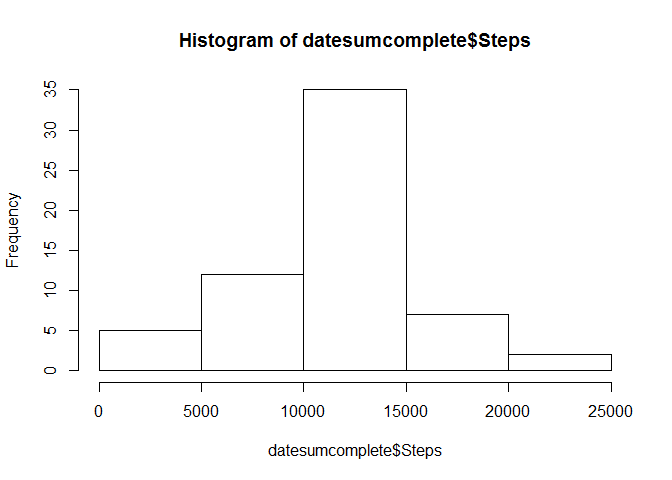
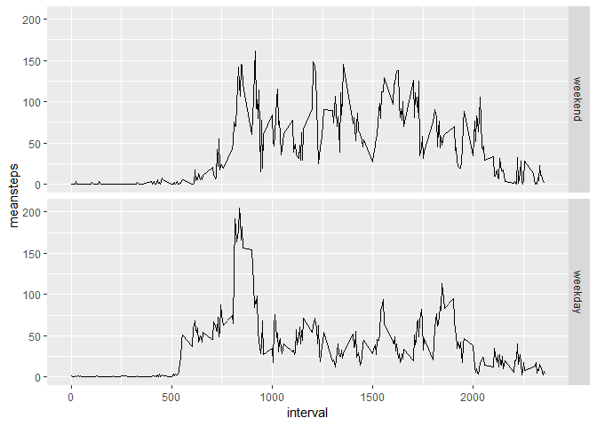

Loading and preprocessing the data
----------------------------------

We import the data, load the required packages and correct the variable category

``` r
setwd("C:/Users/310192577/Documents/Course/5_Reproducible_Research/week 2")
activity<-read.csv2("activity.csv", sep=",", stringsAsFactors = FALSE)
```

``` r
activity$steps<-as.numeric(activity$steps)
activity$date<-as.Date(activity$date)
nona<-na.omit(activity)
```

What is the mean total of steps taken per day?
----------------------------------------------

Now we sum the steps per day and make a histogram out of it.

``` r
#prep data for plot
datesum<-aggregate(nona$steps, by=list(nona$date), sum)
names(datesum)<-c("Date", "Steps")
datesum$Date<-as.Date(datesum$Date)
#create plot
hist(datesum$Steps)
```



What is the average daily activity pattern?
-------------------------------------------

The following piece of code calculates the average number of steps for each interval and creates a time series plot. You will see that the highest average maximum number of steps per interval is shown by the last call (206).

``` r
#prep data for plot
intmean<-aggregate(nona$steps, by=list(nona$interval), mean)
names(intmean)<-c("interval", "steps")
#get plot
ggplot(intmean, aes(x=interval, y=steps)) + geom_line() +ylab("average steps per interval")
```



``` r
#get max
max(intmean$steps)
```

    ## [1] 206.1698

Imputing missing values
-----------------------

``` r
#number of missing values
sum(is.na(activity$steps))
```

    ## [1] 2304

``` r
#impute missing values using predictive mean matching
iris.impu <- mice(data=activity, m=5, method= "pmm", seed=500)
completedData<-mice::complete(iris.impu,2)
```

``` r
#prep data for plot
datesumcomplete<-aggregate(completedData$steps, by=list(completedData$date), sum)
names(datesumcomplete)<-c("Date", "Steps")
datesumcomplete$Steps<-as.numeric(datesumcomplete$Steps)
datesumcomplete$Date<-as.Date(datesumcomplete$Date)
#create plot
hist(datesumcomplete$Steps)
```



``` r
#get metrics
mean(datesumcomplete$Steps)
```

    ## [1] 11016.85

``` r
median(datesumcomplete$Steps)
```

    ## [1] 11162

Are there differences in activity patterns between weekdays and weekends?
-------------------------------------------------------------------------

Yes, on weekdays there is a higher maximym and activity starts earlier, activity remains more constantly high during the weekend.

``` r
#create weekdaytype variable
weekdays <- c('Monday', 'Tuesday', 'Wednesday', 'Thursday', 'Friday')
completedData$date<-as.Date(completedData$date)
completedData$weekpart<-factor((weekdays(completedData$date) %in% weekdays), levels=c(FALSE, TRUE), labels=c('weekend', 'weekday') )
daymean<-aggregate(completedData$steps, by=list(completedData$interval, completedData$weekpart), mean)
names(daymean)<-c("interval","day", "meansteps")
#create plot
ggplot(daymean,aes(x=interval,y=meansteps,group=day))+geom_line()+facet_grid(day~.)
```


